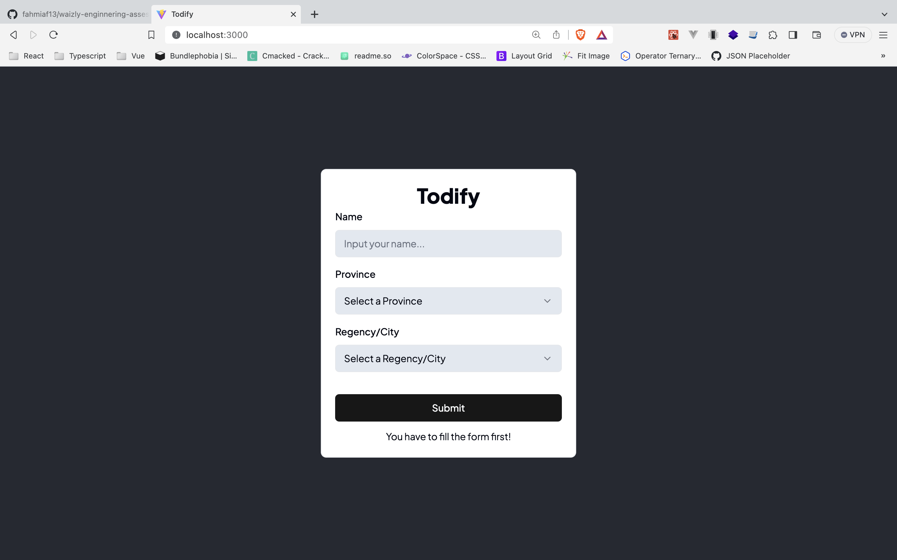
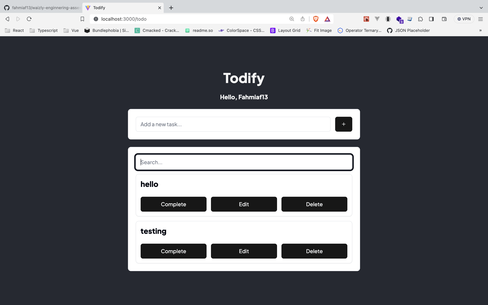

# Todify

## ⚙️ Tech Stack

<a href="https://reactjs.org/" target="_blank" rel="noreferrer">  </a>
<a href="https://tailwindcss.com/" target="_blank" rel="noreferrer">  </a>
<a href="[https://developer.mozilla.org/en-US/docs/Web/JavaScript](https://www.typescriptlang.org/)" target="_blank" rel="noreferrer">  </a>
<a href="https://redux.js.org" target="_blank" rel="noreferrer">  </a>
<a href="https://vitejs.dev/" target="_blank" rel="noreferrer">  </a>
<a href="https://pnpm.io" target="_blank" rel="noreferrer">  </a>

## 📚 Documentation

<p align="center">
<p>Home<p/>

<p>Todo<p/>

</p>

## 📥 Installation

### Install with pnpm

Install dependencies

```bash
$ pnpm i
```

Start the server

```bash
$ pnpm run dev
```

Copyright (c) 2023 Fahmi Achmad

[](https://choosealicense.com/licenses/mit/)
# waizly-enginnering-assesment
